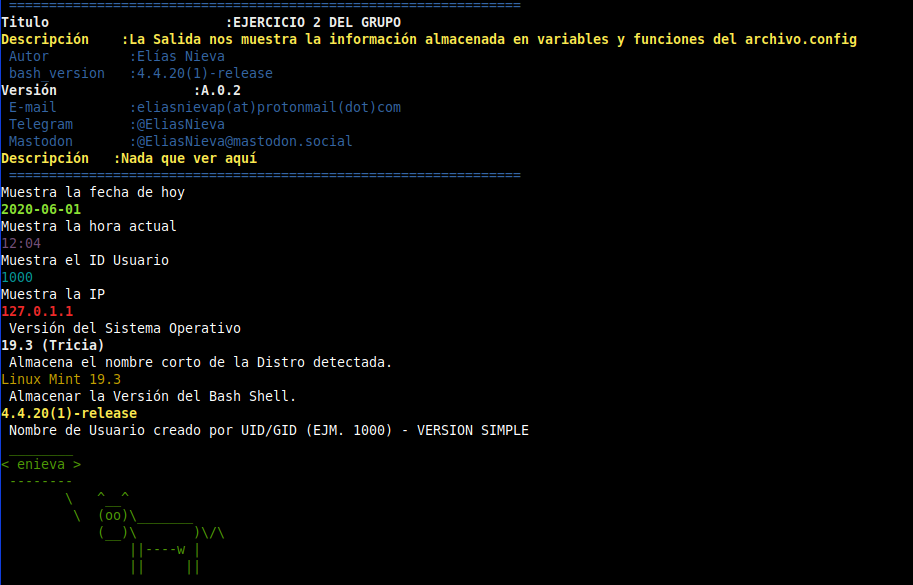

[INICIO]({{ site.url }})  [ADMINISTRADORES]({{ site.admin }}) [EJERCICIOS]({{ site.ejer }}) [DOCUMENTACIÓN]({{ site.docu }}) [TUTORIALES]({{ site.tuto }}) [GRUPO DE TELEGRAM]({{ site.telegram }})

#   RESULTADO EJERCICIO_2

<html>
<H1>
	404 . Nada que ver aquí
	 
	</H1>
	Todavía estamos en plazo de Ejecución
</html>

Resultado Final de Como Debería Quedar.

------

 

------