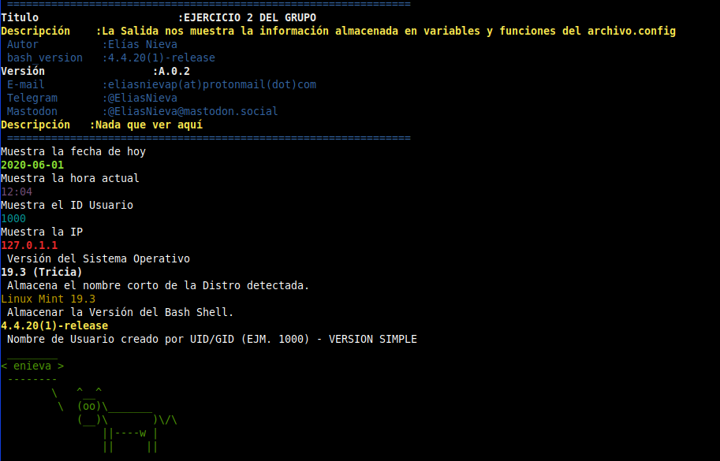

[<==Regresar](../README.md) _ [GRUPO DE TELEGRAM](https://t.me/shell_cli_bash_scripting) _ [EJERCICIO_2](2_EJERCICIO.md) _ [AUTOR](../about.md) _ [ADMINISTRADORES](../administradores.md)

#   RESULTADO EJERCICIO_2

<html>
<H1>
	404 . Nada que ver aquí
	 
	</H1>
	Todavía estamos en plazo de Ejecución
</html>

Resultado Final de Como Debería Quedar.

